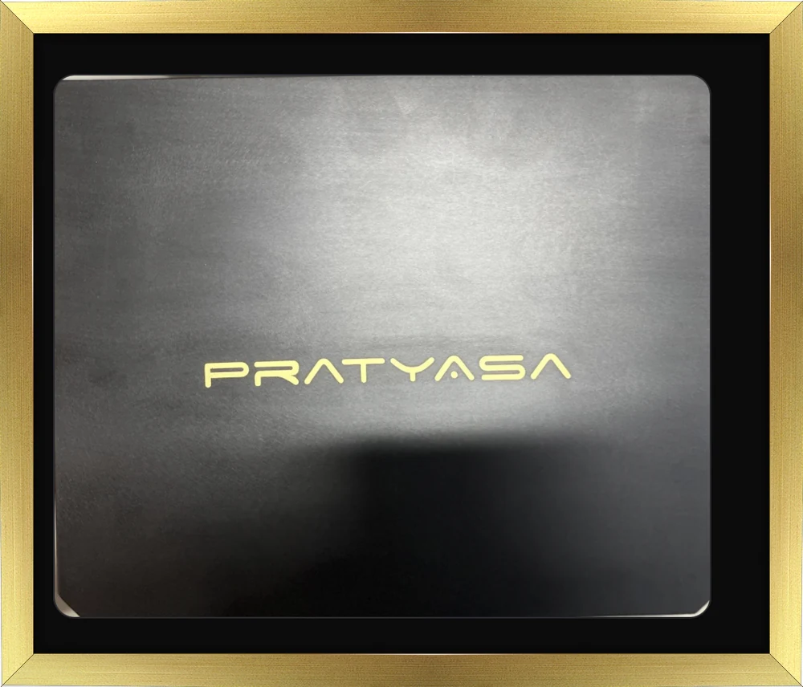
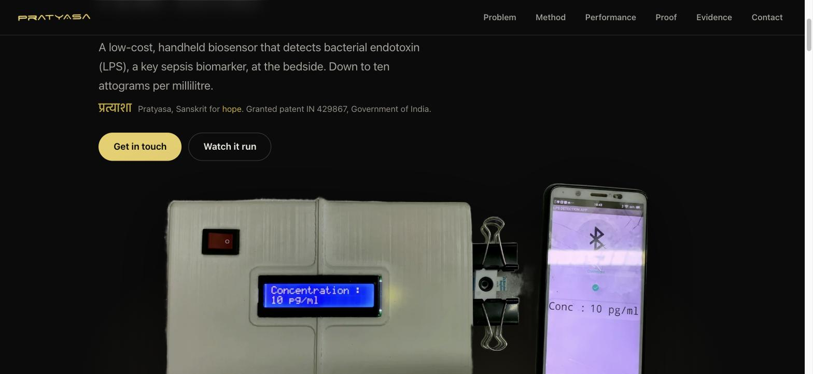
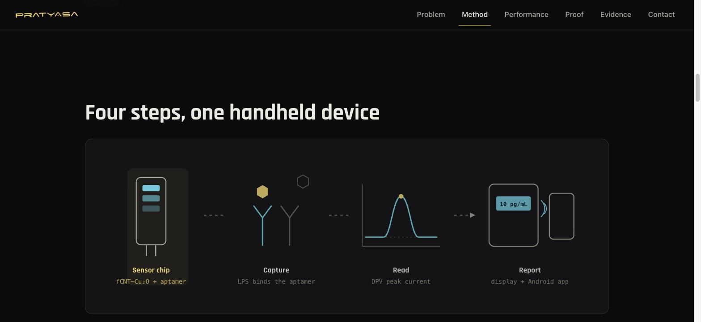
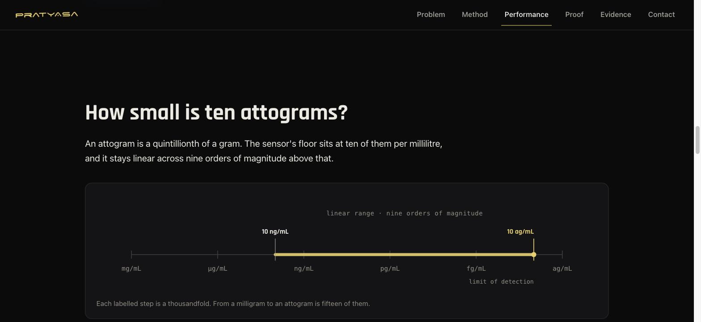
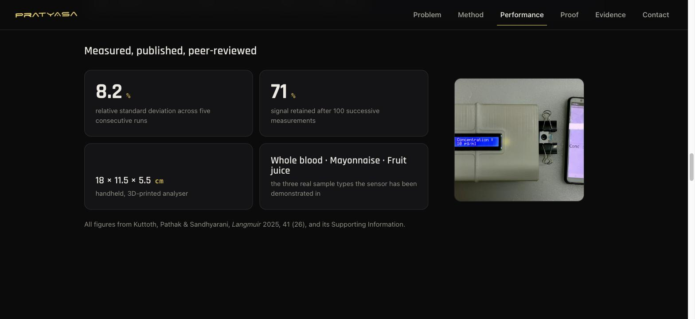
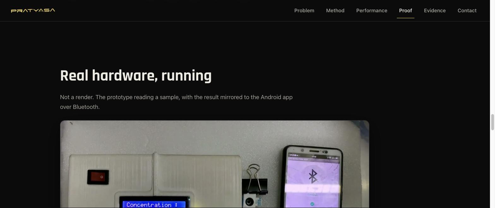
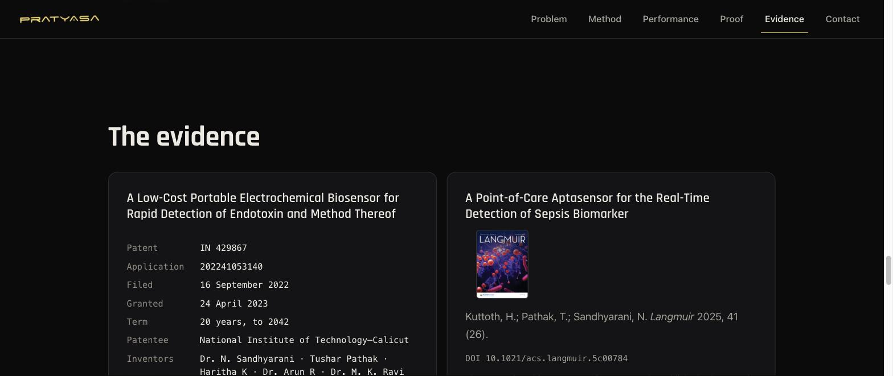

<div align="center">



<h3>Sepsis moves in hours. Pratyasa answers in real time.</h3>

A single static page presenting granted Indian patent **IN&nbsp;429867** — a low-cost, handheld biosensor that detects endotoxin, a key sepsis biomarker, at the point of care.

<p>


</p>

</div>

**Pratyasa** (प्रत्याशा, Sanskrit for *hope*) is a technical record — a landing page for a real
piece of hardware. It presents the granted patent, the peer-reviewed *Langmuir* 2025 paper that
cites it, and footage of the working prototype reading a sample and mirroring the result to an
Android app over Bluetooth. It is for clinicians, researchers, and anyone who wants to verify the
claim rather than take it on trust.

The whole thing is one `index.html`, one stylesheet, one script, and a web app manifest. No
framework, no build step, no dependencies, no third-party requests, no analytics.

**Live:** https://pratyasa.vercel.app

## Highlights

- **Granted patent, on the record** — IN 429867 (filed Sept 2022, granted April 2023, term to 2042), with the grant certificate and a link to verify it on the Indian Patent Office register.
- **Peer-reviewed** — links the *Langmuir* 2025 paper (41, 26) by its DOI; the paper cites this patent as reference 38, so the science and the claim point at each other.
- **Interactive method diagram** — a four-stage SVG pipeline you step through; clicking a step drives the diagram and clicking the diagram drives the steps, fully keyboard-operable.
- **Real hardware footage** — an embedded clip of the prototype in use, with a graceful download-fallback state if the video can't play.
- **Logarithmic detection-range chart** — a hand-built SVG placing the 10 ag/mL floor across nine orders of magnitude, with a separate vertical ladder for narrow screens.
- **Works with JavaScript off** — progressive enhancement only: every method step is readable and every diagram stage visible without a script. JS adds the stepper, scroll reveals, and nav scrollspy.
- **Installable PWA** — web app manifest with maskable icons and standalone display.
- **Fact-lock gate** — `verify-facts.py` asserts every load-bearing figure is present on the page and that forbidden claims (`FDA`, `CE mark`, `clinically validated`, `for sale`, …) are absent.
- **Accessible by construction** — skip link, `aria-current` scrollspy, titled/described SVGs, and respect for `prefers-reduced-motion`.

## Screenshots

Captured from the running app. Pratyasa is **dark-theme only by design** — the white enclosure
disappears on a light ground and gold-on-white fails contrast — so these are shown in that theme.

### Hero — the prototype reading 10 pg/mL, mirrored to the paired phone



### Method — a four-step pipeline you can click through



### Performance — nine orders of magnitude down to the 10 ag/mL floor



### Measured — published, peer-reviewed figures



### Proof — real hardware, running



### Evidence — the granted patent and the paper that cites it



## Getting started

There is no build step. Any static file server will do; Python's is already on most machines.

```sh
git clone https://github.com/007U5H4R/pratyasa.git
cd pratyasa
python3 -m http.server 8080
# then open http://localhost:8080/
```

Opening `index.html` directly over `file://` works too, because every asset path is relative.

## How it works

- **No server, no database.** A single static HTML page plus a web app manifest. Every asset path is relative and the manifest's `start_url`/`scope` are `"./"`, so it runs identically on Vercel, GitHub Pages, or a local file.
- **Progressive enhancement.** `app.js` is enhancement only — it adds the `js` class, the two-way stepper↔diagram sync, and `IntersectionObserver`-driven scroll reveals and nav scrollspy. With it disabled the page is still complete.
- **Fact-lock before every commit.** `verify-facts.py` normalises the DOM (strips script/style/comments/tags, collapses whitespace) *then* matches a required/forbidden phrase list, because values are split across elements (`<span>10</span><span>ag/mL</span>`). If it fails, the fix is the page — never the checker.
- **Self-contained assets.** Rajdhani fonts are self-hosted, the demo is a trimmed H.264 clip, and images are WebP/JPEG — no external fetches at runtime.

## Development

No package manager, typechecker, linter, or test runner — it's vanilla by intent.

```sh
python3 -m http.server 8080   # serve locally
python3 verify-facts.py       # the fact-lock gate — run before every commit
```

`verify-facts.py` is the project's most important gate: a public page that misstates a patent
number or drifts into an unsupportable claim is the only failure here with real consequences.

## Credits & license

Patent **IN 429867** is owned by the **National Institute of Technology–Calicut** and credited to
its five named inventors — Dr. N. Sandhyarani, Tushar Pathak, Haritha K, Dr. Arun R, and
Dr. M. K. Ravi Varma — for work carried out in Dr. Sandhyarani's group. The peer-reviewed results
are from Kuttoth, Pathak & Sandhyarani, *Langmuir* 2025, 41 (26)
([DOI 10.1021/acs.langmuir.5c00784](https://doi.org/10.1021/acs.langmuir.5c00784)).

This page is a technical record maintained by co-inventor Tushar Pathak, not an offer to license
the patent; licensing enquiries go to NIT–Calicut as patentee. The device is a research prototype
and is **not** an approved or regulated diagnostic product. No open-source license file accompanies
this repository — all rights reserved unless stated otherwise.
